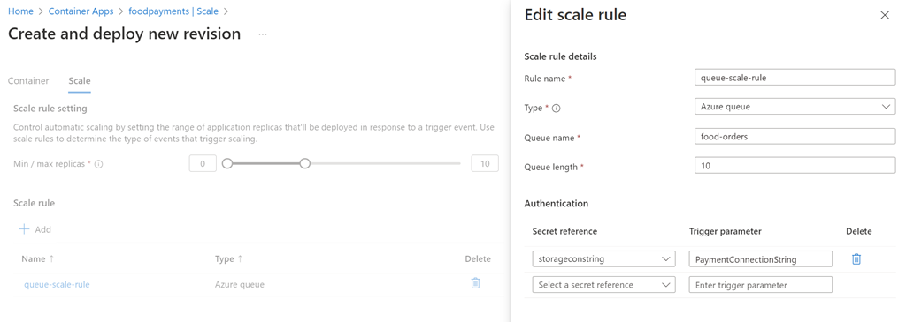

# Jobs in Azure Container Apps

[invoices-job](/app/services/invoices-job/) is a job that generates invoices for the food orders. It is triggered by a message in a queue. The job is implemented as an Azure Function that runs in a container. The container is hosted in an Azure Container App. 

- `create-invoices-job.azcli` contains all required steps to develop, test and deploy the demo

- Examine [GenerateInvoice.cs](/app/services/invoices-job/Job/GenerateInvoice.cs) Azure Function that will run in a container. It mocks a long running process by sleeping for 100ms and is triggered by a message in a queue.

    ```c#
    [FunctionName("generateInvoice")]
    public static async Task RunAsync([QueueTrigger("food-orders", Connection = "InvoiceConnectionString")] string item, Binder binder, ILogger log)
    {
        log.LogInformation($"Processing item: {item}");
        Util.CheckThrottle();
        var pdfStream = Util.CreatePDF(item);
        ...
    }    
    ```
    >Note: You can also examine the `./invoices-job/dockerfile` to understand details of the container image creation. You have to provide a valid connection string

- Create a storage account with a queue, a container for the generated invoices and get its connection string

    ```bash
    az storage account create -n $storageAcct -g $grp --kind StorageV2 --sku Standard_LRS
    storageKey=$(az storage account keys list -n $storageAcct --query "[0].value")
    az storage container create --account-name $storageAcct --account-key $storageKey --name $container
    az storage queue create -n $queue --account-key $key --account-name $storageAcct
    storageConStr=$(az storage account show-connection-string -n $storageAcct -g $grp \
    --query connectionString -o tsv)
    ```

- Test the container locally    

    ```bash
    messageOne=$(echo "Hello Queue Reader App" | base64)
    az storage message put --content $messageOne --queue-name $queue \
    --connection-string $conStr
    ```

    >Note: You can check the state of the queue using the Azure Portal or the Azure CLI:

    ```
    az storage blob list --container-name $container --connection-string $conStr --output table 
    ```

- Create a local function app container

    ```bash
    docker build --rm -f dockerfile -t $img .
    ```

- Create container app environment and deploy a container to it:

    ```bash
    az containerapp create -n $app -g $grp --environment $acaenv \
    --registry-server $acr.azurecr.io \
    --registry-username $acr \
    --registry-password $acrpwd \
    --image $acr.azurecr.io/$img \
    --secrets "storagecon=$conStr" \
    --env-vars Sleep=500 InvoiceConnectionString=secretref:storagecon
    ```

    Set a scaling rule for the container app:

    ```bash
    az containerapp update -n $app -g $grp \
    --scale-rule-name queue-scaling \
    --scale-rule-type azure-queue \
    --scale-rule-metadata queueName=food-orders queueLength=10 \
    --scale-rule-auth secretRef=storagecon triggerParameter=InvoiceConnectionString
    ```

    

- Send a single message to the queue and check the logs of the container app instance:

    ```bash
    messageOne=$(echo "Hello Queue Reader App" | base64)
    az storage message put --content $messageOne --queue-name $queue 
        \--connection-string $queueConStr
    ```

- Send a bunch of messages to the queue using `./order-creator` and check if the have been processed