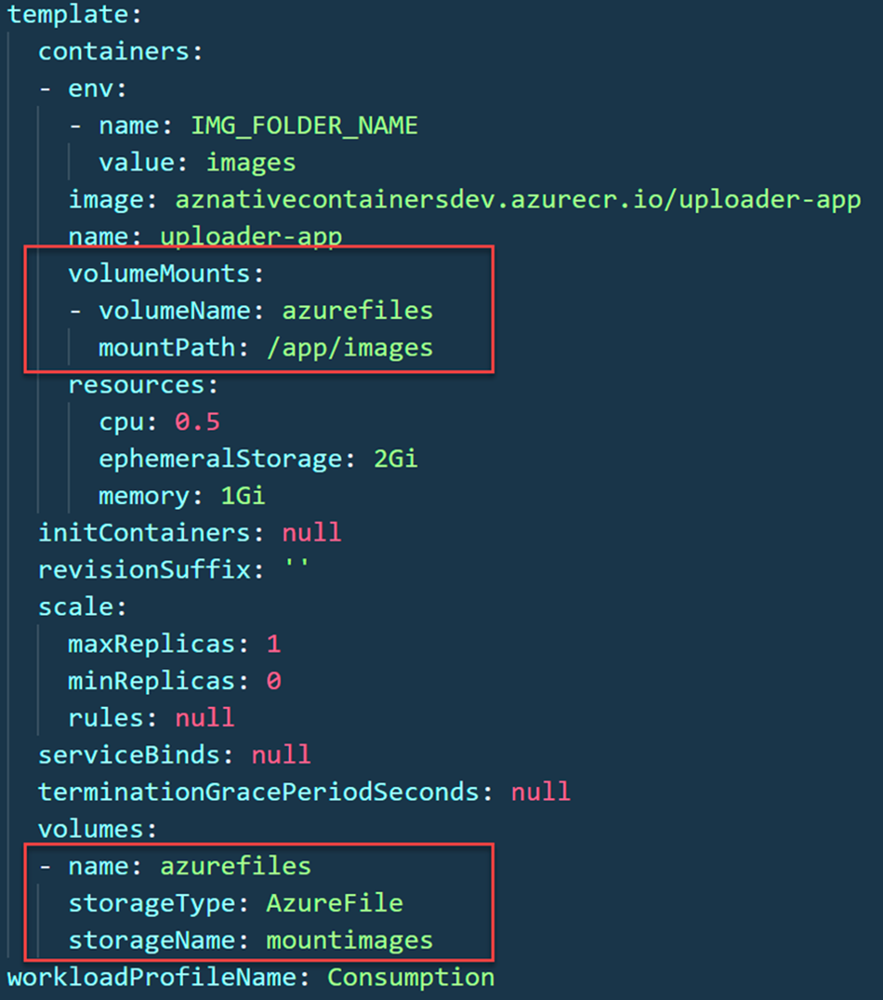

# Stateful Apps using Volume Mounts & Persistent Storage

In this demo we will attach a share created in Azure Storage Account to a container app. This will allow us to store data in a persistent manner. 

## Links & Resources

[Azure Container Apps - Storage Mounts](https://learn.microsoft.com/en-us/azure/container-apps/storage-mounts?pivots=azure-cli)

## Demo

- Take detailed instructions from `deploy-stateful-app.azcli`.

- To attach Azure Files as storage download the `yaml` for the container app to modify it and to mount a volume to the container app. Upload it after you have modified it.

    ```bash
    az containerapp show -n $imgUploader -g $grp -o yaml > uploader.yaml
    ```

    ```yaml
    volumeMounts:
    - volumeName: azurefiles
      mountPath: /app/images
    ```

    ```yaml
    - name: azurefiles
        storageType: AzureFile
        storageName: mountimages
    ```

    >Note: You can chose the volume name but you can only use alpha characters and no special characters
    

    

    ```bash
    az containerapp update -n $uploader -g $grp --yaml uploader.yaml
    ```