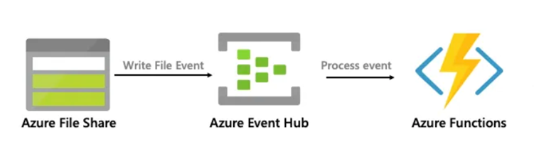

# Collect Events from Azure Storage File Share in Event Hub

In this demo, we will collect events from Azure Storage File Share in Event Hub. As Azure File Share does not publish events to event grid, we will use 

