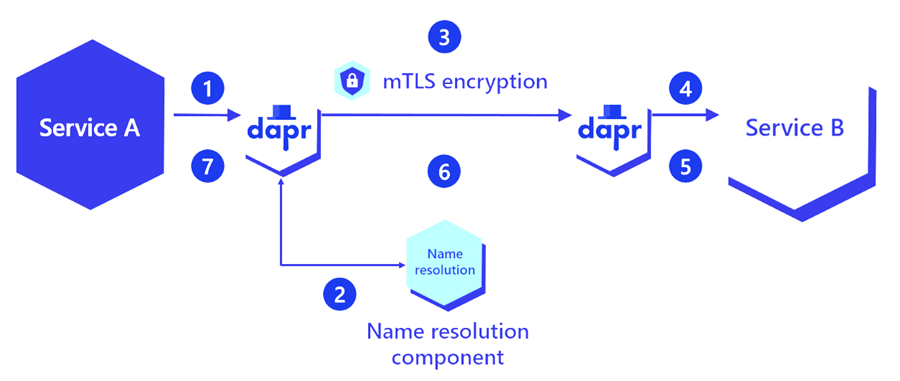

# Dapr Service Invocation & Bindings

## Dapr Service Invocation

Dapr provides service to service invocation using it own sidecar. The advantage in not consuming the REST-API directly is because we want to use the benefits of Dapr service invocation which are:
- Service discovery
- Standardizing API calls between services.
- Secure inter-service communication.
- Mitigating request timeouts or failures and automatic handling of retries and transient errors
- Implementing observability and tracing using OpenTelemetry
    
    

- [food-api-dapr](../00-app/food-api-dapr) is a REST API that exposes a set of endpoints to manage food items.

    ```c#
    [HttpGet()]
    public IEnumerable<FoodItem> GetFood()
    {
        return ctx.Food.ToArray();
    }
    ```

- This method is consumed by [food-mvc-dapr](../00-app/food-mvc-dapr/) Examine its [Program.cs](../00-app/food-invoices-dapr/Program.cs) and notice the following code:

    ```c#
    builder.Services.AddDapr();
    ...
    app.UseCloudEvents();
    ...
    app.MapSubscribeHandler();    
    ```

- `AddDapr()` registers the necessary services to integrate Dapr into the MVC pipeline. It also registers a `DaprClient` instance into the dependency injection container. 
- `UseCloudEvents()` adds CloudEvents middleware into the ASP.NET Core middleware pipeline. This middleware will unwrap requests that use the CloudEvents structured format, so the receiving method can read the event payload directly.
- `MapSubscribeHandler()` registers a route handler for the `dapr/subscribe` endpoint. This endpoint is used by Dapr to register the subscriber with the pub/sub component. The route handler will read the topic name from the request and register the subscriber with the pub/sub component.    

- Examine the current state of [HomeController.cs](../00-app/food-mvc-dapr/Controllers/HomeController.cs) and notice that it is using direct service invocation to get the food items:
    
    ```c#
    public async Task<IActionResult> Index()
    {
        HttpClient client = new HttpClient();
        var daprResponse = await client.GetAsync($"http://localhost:{BACKEND_PORT}/v1.0/invoke/{BACKEND_NAME}/method/food");
        var jsonFood = await daprResponse.Content.ReadAsStringAsync();
        ViewBag.Food =  JsonSerializer.Deserialize<List<FoodItem>>(jsonFood);;
        return View();
    }
    ```

- Run the UI and test the implementation:

    ```bash
    cd food-dapr-fronted
    dapr run --app-id food-fronted --app-port 5002 --dapr-http-port 5011 dotnet run
    ```

- It should return the following result:

    

## Dapr Bindings

Dapr bindings are a way to declaratively connect your application to another service. Dapr bindings are event-driven and can be triggered by an event or run on a schedule. Dapr bindings are implemented as an output binding, an input binding, or a bidirectional binding.

