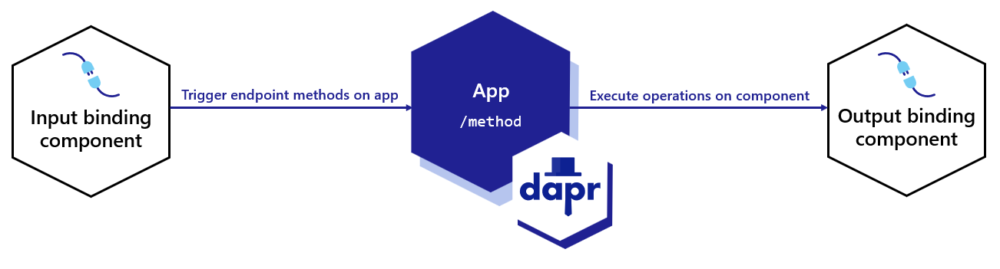

# Dapr Bindings

Dapr bindings are a way to declaratively connect your application to another service. Dapr bindings are event-driven and can be triggered by an event or run on a schedule. Dapr bindings are implemented as an output binding, an input binding, or a bidirectional binding.

