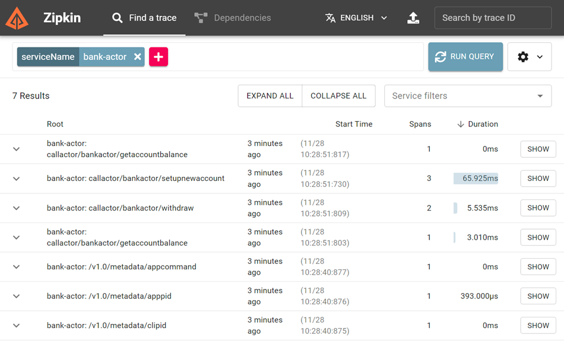

# Observability and Distributed Tracing

[Zipkin](https://zipkin.io/) is a distributed tracing system. It helps gather timing data needed to troubleshoot latency problems in service architectures. Features include both the collection and lookup of this data.

## Demo

### Tracing

- Add the Zipkin configuration to your dapr app:

    ```yaml
    apiVersion: dapr.io/v1alpha1
    kind: Configuration
    metadata:
    name: config
    namespace: food-app
    spec:
    tracing:
        samplingRate: "1"
        zipkin:
        endpointAddress: "http://zipkin:9411/api/v2/spans"
    ```

- Run the app

    ```bash
    dapr run --app-id bank-actor --app-port 5005 --dapr-http-port 3500 --resources-path './components' dotnet run 
    ```
- Open http://localhost:9411/zipkin/ and search for the service name `bank-actor` to see the traces.

    

### Logging

- Add `--log-as-json` to your run configuration:

    ```bash
    dapr run --app-id bank-actor --app-port 5005 --dapr-http-port 3500 --resources-path './components' --log-as-json dotnet run 
    ```

    >Note: If you wish you could also use [New Relic](https://v1-6.docs.dapr.io/operations/monitoring/logging/newrelic/) or use the [Application Insights Collector](https://docs.dapr.io/operations/observability/tracing/otel-collector/open-telemetry-collector-appinsights/)

### Metrics

[Set up Azure Monitor to search logs and collect metrics](https://docs.dapr.io/operations/observability/metrics/azure-monitor/)
