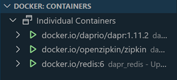
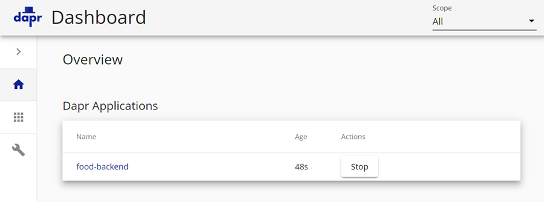
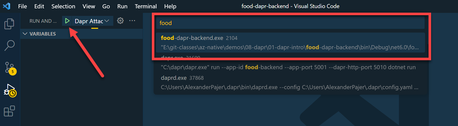
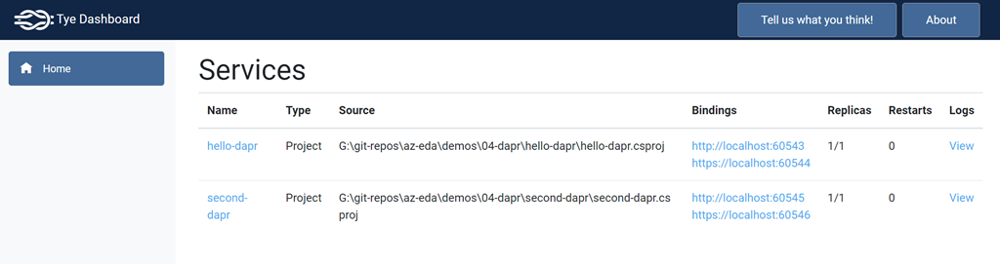

# Dapr Introduction

This sample introduces Dapr and how to use it to build microservices and is based on the [Dapr quickstarts](https://docs.dapr.io/getting-started/quickstarts/). 

It contains two projects:

- `food-dapr-backend` - A .NET Core Web API project that uses Entity Framework and Dapr to store and retrieve food orders.
- `food-dapr-frontend` - An MVC project that uses Dapr to call the backend API.

Dapr configuration is stored in the [components](components) folder and container the following files:

- `statestore.yaml` - Configures the state store to use Azure Blob Storage.

## Readings

[Dapr CLI](https://docs.dapr.io/reference/cli/cli-overview/)

[Dapr Visual Studio Code extension](https://docs.dapr.io/developing-applications/local-development/ides/vscode/vscode-dapr-extension/)

[Developing Dapr applications with Dev Containers](https://docs.dapr.io/developing-applications/local-development/ides/vscode/vscode-remote-dev-containers/)

## Installation & First Run

- Install Dapr CLI

    ```
    Set-ExecutionPolicy RemoteSigned -scope CurrentUser
    powershell -Command "iwr -useb https://raw.githubusercontent.com/dapr/cli/master/install/install.ps1 | iex"
    ```

    >Note: Restart the terminal after installing the Dapr CLI

- Initialize default Dapr containers

    ```
    dapr init
    ```

    

   >Note: To remove the default Dapr containers run `dapr uninstall` 

- Run project `food-dapr-backend`

    ```
    cd food-dapr-backend
    dapr run --app-id food-backend --app-port 5001 --dapr-http-port 5010 dotnet run
    ```

- Run project `food-dapr-fronted`

    ```
    cd food-dapr-fronted
    dapr run --app-id food-fronted --app-port 5002 --dapr-http-port 5011 dotnet run
    ```    

- Show Dapr Dashboard

    ```
    dapr dashboard
    ``` 

- Examine Dapr Dashboard on http://localhost:8080:

    

## Using State Store

- Examine `CountController.cs` and call it multiple times to increment the counter:

    ```c#
    [HttpGet("getCount")]
    public async Task<int> Get()
    {
        var daprClient = new DaprClientBuilder().Build();
        var counter = await daprClient.GetStateAsync<int>(storeName, key);
        await daprClient.SaveStateAsync(storeName, key, counter + 1);
        return counter;
    }
    ```

- Examine the `Dapr Attach` config in `launch.json` and use it to attach the debugger to the `food-dapr-backend` process and debug the state store code:

    ```json
    {
        "name": "Dapr Attach",
        "type": "coreclr",
        "request": "attach",
        "processId": "${command:pickProcess}"
    }
    ```
    

- Examine     


- Install [Tye](https://github.com/dotnet/tye/). Project Tye is an experimental developer tool that makes developing, testing, and deploying microservices and distributed applications easier

    ```
    dotnet tool install -g Microsoft.Tye --version "0.11.0-alpha.22111.1"
    ```

- Create a `tye.yaml` file in the root of the solution by running:

    ```    
    tye init
    ```

    >Note: You can skip this step as the `tye.yaml` file is already included in the solution.

- Run the two projects with Tye

    ```
    tye run
    ```    

    