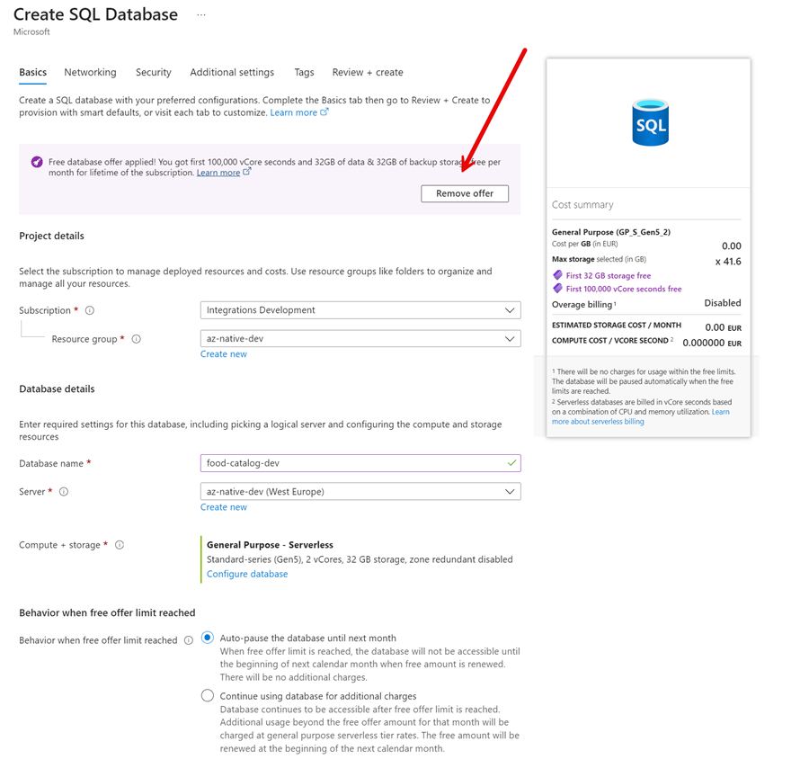
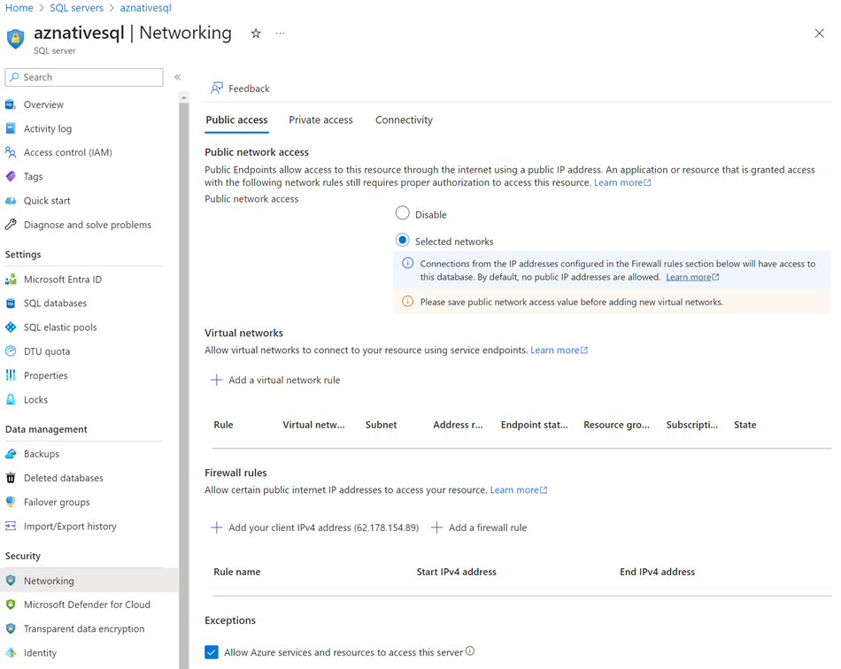

# Lab 02 - Container Essentials

In this Lab we will explore the basics of containers. We will start by containerizing the following apps:

- Catalog Service
- Order Service
- Food Shop UI

>Note: To be able to update your fork of this repository, without having to deal with merge conflicts, use a `lab-02/solution-$env` folder. Copy the content of the `lab-02/solution` folder to `lab-02/solution-$env` and work in the new folder. This way you can always pull the latest changes from the upstream repository and merge them into your fork and keep a clean starter- and solution folder.

## Task: Containerize Catalog Service

- Add a docker file to Catalog Service build and test the container locally.
- Override values from appsettings.json using environment variables.
    - Set the value of UseSQLite to true
    - Set the value of the ApplicationInsight Connection String
    - Set a mock connection string to the new Azure SQL Database
- Build the container using Azure Container Registry (ACR) Build.

- You can use the following modules as a reference: 

    - [Building containers](/demos/02-containers/01-dev-workflow)    
    - [Container config management](/demos/02-containers/05-config-mgmt/)

## Task: Containerize Order Service

- Add a docker file to Orders Api build and test the container locally.
- Build the container using Azure Container Registry (ACR) Build.
    
## Task: Containerize Food Shop

- Add a docker file to Food Shop build and test the container locally.
- Override values from appsettings.json using environment variables.
    - Set ENV_CATALOG_API_URL to the Catalog Service Url
    - Set ENV_ORDERS_API_URL to the Order Service Url

- You can use the following modules as a reference: 

    - [Building Angular containers](/demos/00-app/config-ui/)    

## Task: Docker Compose

- Write a docker compose file to run the containers locally.

- You can use the following modules as a reference: 
    
    - [docker-compose.yml](/demos/02-containers/03-docker-dompose/docker-compose.yml)

## Task: Push to ACR

- Outsource the image creation using Azure Container Registry (ACR) Build Tasks

- You can use the following modules as a reference: 

    - [Azure Container Registry (ACR) Build Tasks](/demos/02-containers/02-publish/publish-images.azcli)    

## Task: Setup an Azure SQL Server and Database - Optional

>Note: We are not scripting this because at the moment there is no way to use the [new free Azure SQL tier](https://learn.microsoft.com/en-us/azure/azure-sql/database/free-offer?view=azuresql) using Azure CLI or Bicep.

- Create a new Azure SQL Server. Use a password that you can remember.

    
  
- Create a new Database

    

- Set the networking rules to allow you own ClientIP and Azure Services

     

- Get the connection string to your Database. You will need it later.

    

    >Note: Use the ADO.NET authentication. Microsoft Entry Password (-less) Authentication is documented [here](https://learn.microsoft.com/en-us/azure/azure-sql/database/authentication-aad-configure?view=azuresql&tabs=azure-powershell). In production this should be the preferred way to authenticate. When using .NET you will have to use the [Microsoft.Data.SqlClient](https://www.nuget.org/packages/Microsoft.Data.SqlClient) package instead of [System.Data.SqlClient](https://www.nuget.org/packages/System.Data.SqlClient/). Find more information [here](https://learn.microsoft.com/en-us/sql/connect/ado-net/sql/azure-active-directory-authentication?view=sql-server-ver16)

- Save the connection string in Azure Key Vault. You will need it later:    

    ```bash
    env=dev
    vault=az-native-kv-$env
    sqlConnectionString=Server="tcp:aznativesql.database.windows.net,1433;Initial Catalog=aznative-food-catalog;Persist Security Info=False;User ID=aznativeadmin;Password=<PASSWORD>;MultipleActiveResultSets=False;Encrypt=True;TrustServerCertificate=False;Connection Timeout=30;"

    az keyvault secret set --vault-name $vault --name "sqlConnectionString" --value $sqlConnectionString
    ```
    
    >Note: You will have to replace the password in the connection string with the password you used when creating the Azure SQL Server.