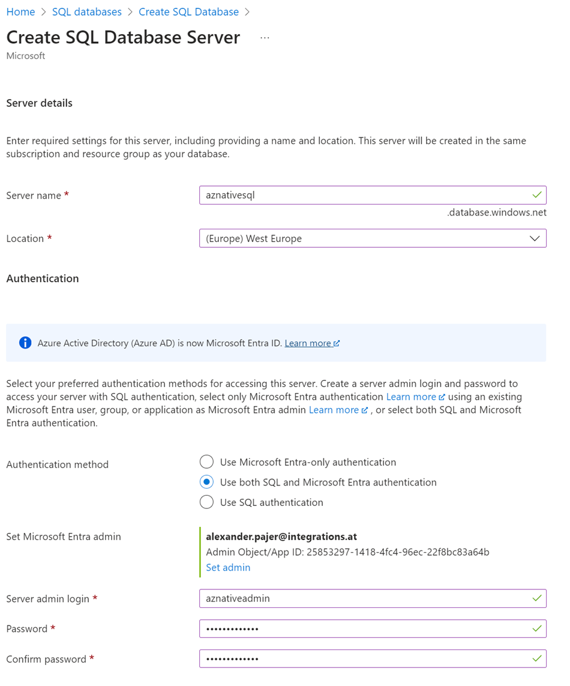
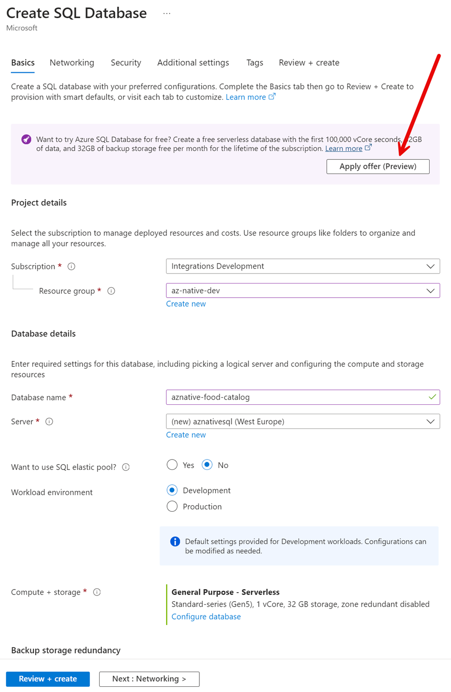
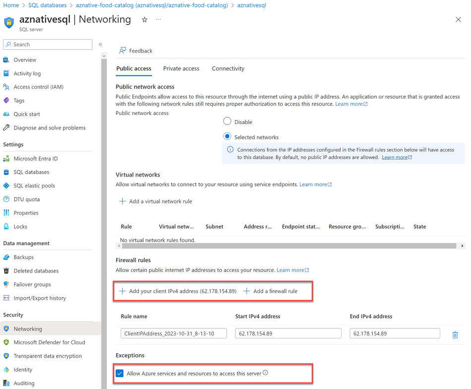
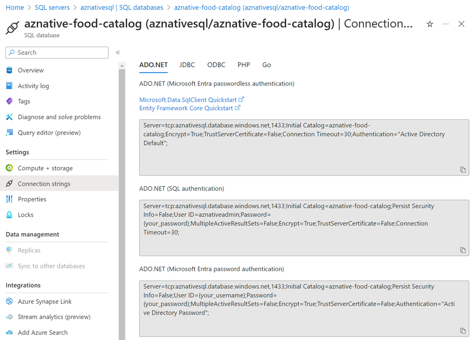

# Solution - Container Essentials

- Build containers in their corresponding folders:

    ```bash
    docker build --rm -f dockerfile -t catalog-service .
    docker build --rm -f dockerfile -t order-service .
    docker build --rm -f dockerfile -t food-shop .
    ```
    >Note: Before building the Angular app run: `npm install` to install the package dependencies.

- To test environment variables injection run:

    ```bash
    docker run -it --rm -p 5051:80 -e "Title=Container Essentials" -e "App:UseSQLite=true" -e "ApplicationInsights:ConnectionString=<Application_Insights_Connection_String>" catalog-service
    ```

- Test catalog-service using it swagger ui on http://localhost:5051/

- Docker compose:

    - Examine docker-compose.yml and run:

    ```bash
    docker-compose up
    ```

- Play with appsettings.json and override other config values until you feel absolutely comfortable with the concept of configuration in containers. Quickly note that in Azure Container Apps you will have to mimic the json structure in the environment variables by using the `__` separator. For example, to override the `App:UseSQLite` value you will have to set the `App__UseSQLite` environment variable.

- To build the containers using ACR Build Tasks, examine [create-images.azcli](./create-images.azcli) and run the script in WSL

## Task: Setup an Azure SQL Server and Database - Optional

>Note: We are not scripting this because at the moment there is no way to use the [new free Azure SQL tier](https://learn.microsoft.com/en-us/azure/azure-sql/database/free-offer?view=azuresql) using Azure CLI or Bicep.

- Create a new Azure SQL Server. Use a password that you can remember.

    
  
- Create a new Database

    

- Set the networking rules to allow you own ClientIP and Azure Services

     

- Get the connection string to your Database. You will need it later.

    

    >Note: Use the ADO.NET authentication. Microsoft Entry Password (-less) Authentication is documented [here](https://learn.microsoft.com/en-us/azure/azure-sql/database/authentication-aad-configure?view=azuresql&tabs=azure-powershell). In production this should be the preferred way to authenticate. When using .NET you will have to use the [Microsoft.Data.SqlClient](https://www.nuget.org/packages/Microsoft.Data.SqlClient) package instead of [System.Data.SqlClient](https://www.nuget.org/packages/System.Data.SqlClient/). Find more information [here](https://learn.microsoft.com/en-us/sql/connect/ado-net/sql/azure-active-directory-authentication?view=sql-server-ver16)

- Save the connection string in Azure Key Vault. You will need it later:    

    ```bash
    env=dev
    vault=az-native-kv-$env
    sqlConnectionString=Server="tcp:aznativesql.database.windows.net,1433;Initial Catalog=aznative-food-catalog;Persist Security Info=False;User ID=aznativeadmin;Password=<PASSWORD>;MultipleActiveResultSets=False;Encrypt=True;TrustServerCertificate=False;Connection Timeout=30;"

    az keyvault secret set --vault-name $vault --name "sqlConnectionString" --value $sqlConnectionString
    ```
    
    >Note: You will have to replace the password in the connection string with the password you used when creating the Azure SQL Server.