# Solution - Developing & Publishing Microservices using Azure Container Apps (ACA)

## Task: Configuration Management

- Execute:

    ```bash
    env=dev
    vault=az-native-kv-$env
    aiKey=$(az keyvault secret show --vault-name $vault --name "aiKey" --query  value -o tsv)
    echo $aiKey
    cosmosKey=$(az keyvault secret show --vault-name $vault --name "cosmosKey" --query  value -o tsv)
    echo $cosmosKey
    ```

    >Note: The values have ben written to the key vault in `lab-01`

## Deploy Catalog Service using the User Interface

### Create a new Azure Container App using the User interface and deploy the [Catalog Service](/app/services/catalog-service/) container to it.

- Use the following settings:

    - Name: catalog-service
    - Container Apps: Environment: acaenv-az-native-$env
    - Image: `$acr/catalog-service:lab-02`
    - Ingress: Allow any kind of traffic
    - Port: `80`

    - 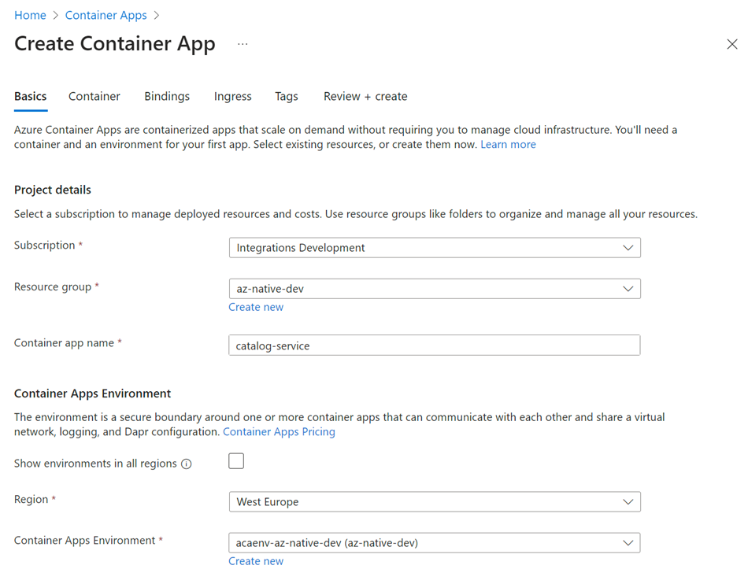

    - 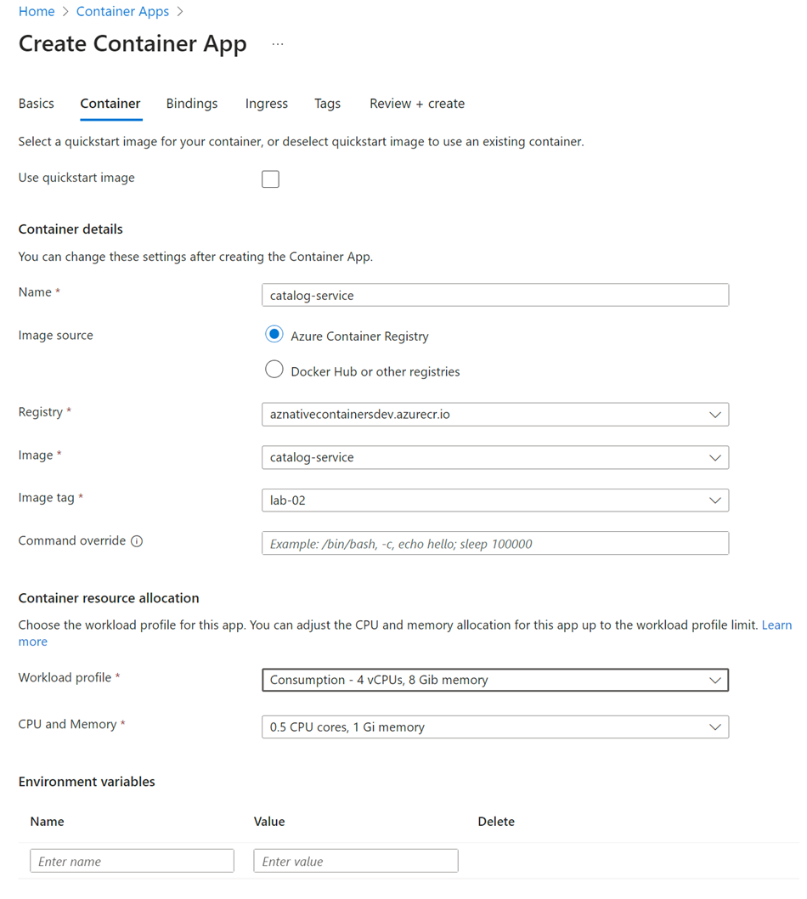

    - 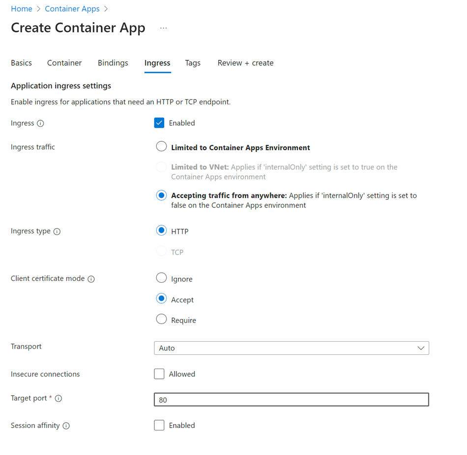

### Create a secret that is linked to Azure Key Vault

- Add a service connection to the key vault in order to set the permissions to access the key vault. You will use a user assigned managed identity:

    - 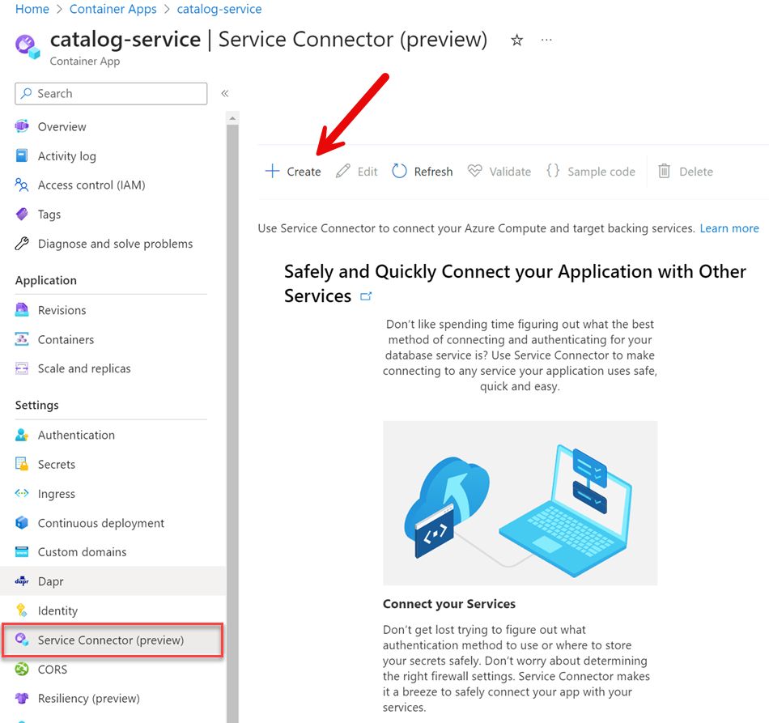

    - 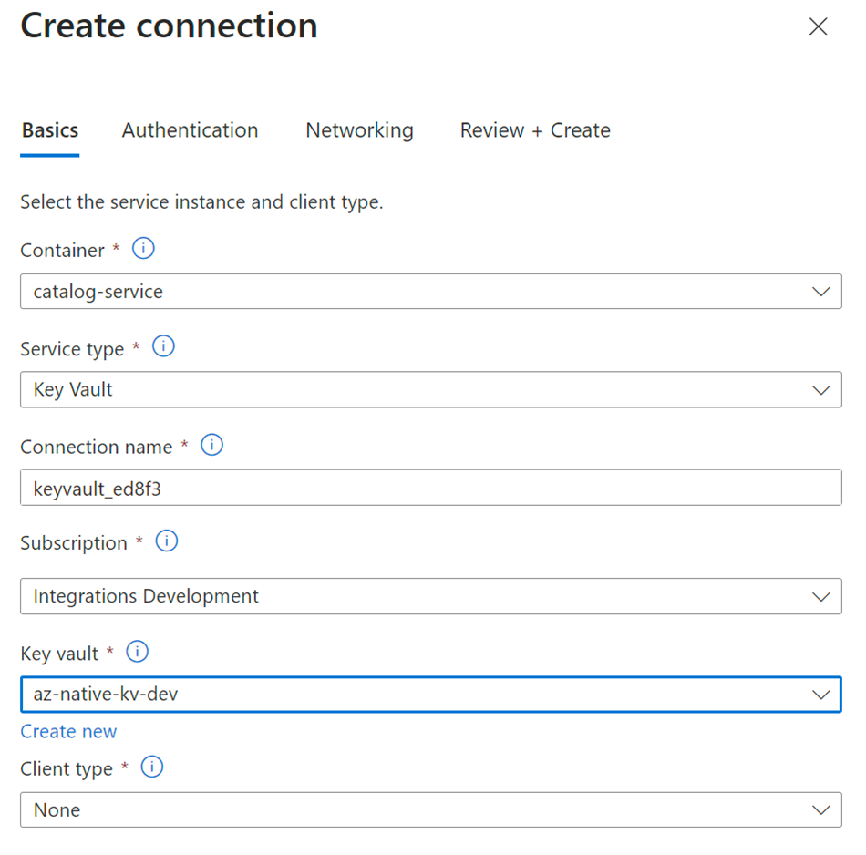

    - 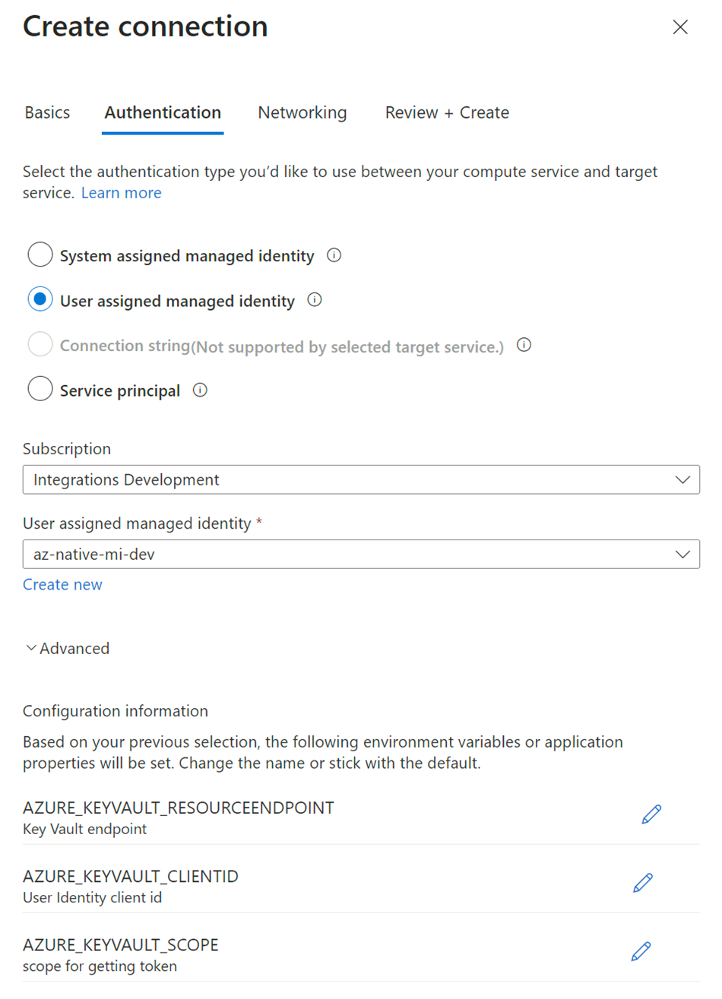

- To get the secret url execute:

    ```bash
    az keyvault secret show --vault-name $vault --name "aiConStr"
    ```

- Copy the value of the `id` property and use it to create a secret in the Azure Container App:

    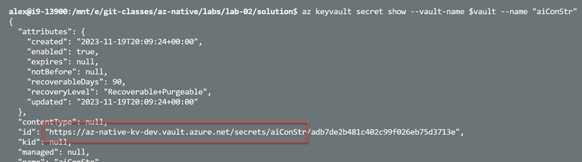    

- Create a secret that is linked to Azure Key Vault:

    - Name: aiconstr

    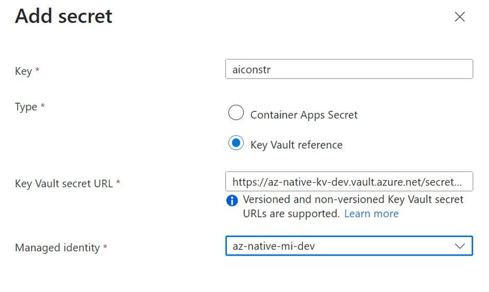        

### Create a revision with injected environment variables

    - Title: Catalog Service ACA
    - App__UseSQLite: true
    - ApplicationInsights__ConnectionString: $aiKey

- Go to `Revisions` and choose to create a new revision

    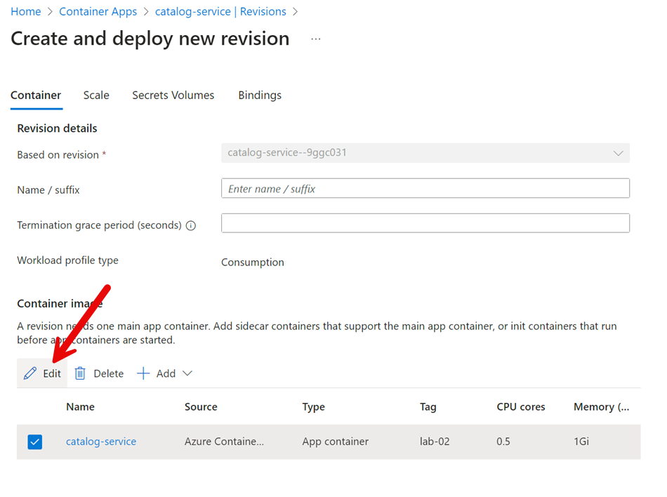

- Add the `ApplicationInsights__ConnectionString` environment variables referencing the secret:

    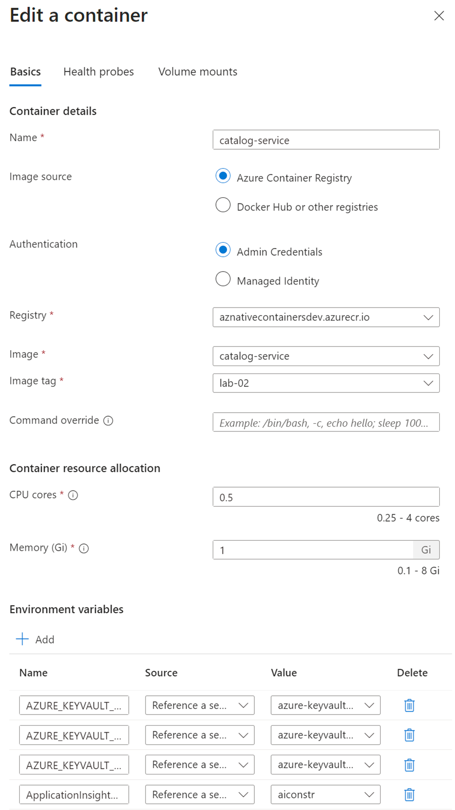

- Choose `Create` to deploy the new revision. Watch how the old revision is being replaced by the new one. Wait until the new revision is running and the old one has been deprovisioned

    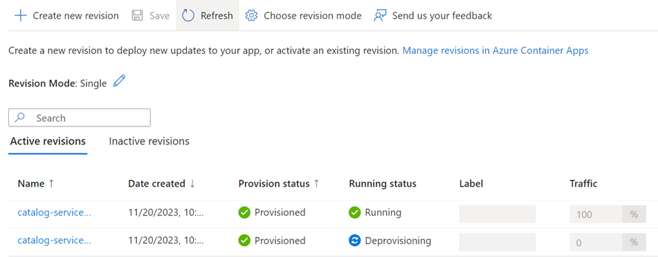

- Repeat this step and for the easy of this lab add the other two values as manual entries:

    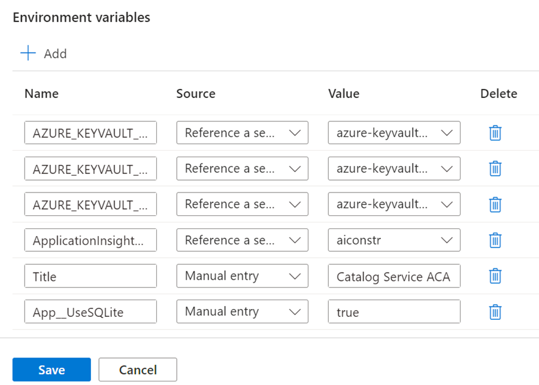

- If you want you can go to the `Console Tab` connect to bin/sh and execute `env` to see the environment variables

    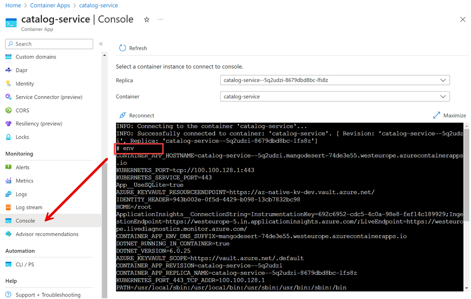 

- You can now test the Catalog Service using the Swagger UI by navigating to the `Application Url` in the `Overview` tab
    - Execute `GET /config`
    - Execute `GET /food`
