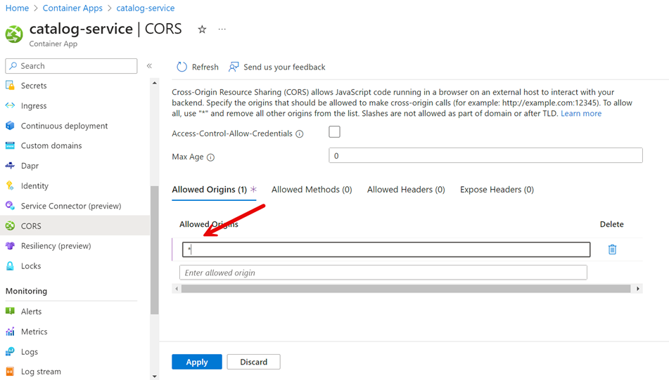

# Solution - Developing & Publishing Microservices using Azure Container Apps (ACA)

## Task: Configuration Management

- Execute:

    ```bash
    env=dev
    vault=az-native-kv-$env
    aiKey=$(az keyvault secret show --vault-name $vault --name "aiKey" --query  value -o tsv)
    echo $aiKey
    cosmosKey=$(az keyvault secret show --vault-name $vault --name "cosmosKey" --query  value -o tsv)
    echo $cosmosKey
    ```

    >Note: The values have ben written to the key vault in `lab-01`

## Deploy Catalog Service using the User Interface

### Create a new Azure Container App using the User interface and deploy the [Catalog Service](/app/services/catalog-service/) container to it.

- Use the following settings:

    - Name: catalog-service
    - Container Apps: Environment: acaenv-az-native-$env
    - Image: `$acr/catalog-service:lab-02`
    - Ingress: Allow any kind of traffic
    - Port: `80`

    - 

    - 

    - 

### Create a secret that is linked to Azure Key Vault

- Add a service connection to the key vault in order to set the permissions to access the key vault. You will use a user assigned managed identity:

    - 

    - 

    - 

- If you want you can use the "validate" button to validate the connector on the Service Connector tab

- To get the secret url execute:

    ```bash
    az keyvault secret show --vault-name $vault --name "aiConStr"
    ```

- Copy the value of the `id` property and use it to create a secret in the Azure Container App:

        

- Create a secret that is linked to Azure Key Vault:

    - Name: aiconstr

            

### Create a revision with injected environment variables

    - Title: Catalog Service ACA
    - App__UseSQLite: true
    - ApplicationInsights__ConnectionString: $aiKey

- Go to `Revisions` and choose to create a new revision

    

- Add the `ApplicationInsights__ConnectionString` environment variables referencing the secret:

    

- Choose `Create` to deploy the new revision. Watch how the old revision is being replaced by the new one. Wait until the new revision is running and the old one has been deprovisioned

    

- Repeat this step and for the easy of this lab add the other two values as manual entries:

    

- If you want you can go to the `Console Tab` connect to bin/sh and execute `env` to see the environment variables

     

- Add a CORS rule for all Origins:

        

- You can now test the Catalog Service using the Swagger UI by navigating to the `Application Url` in the `Overview` tab. In a second tab watch the `Log Stream` to see the logs of the container. If you have configured Application Insight, you can also navigate there and see request after a while.

    - Execute `GET /config`
    - Execute `GET /food`


>Note: [deploy-catalog-mi.azcli](./deploy-catalog-mi.azcli) contains the commands to deploy the catalog service using the managed identity and service connection

## Deploy Orders Service & Food Shop

>Note: In this demo we will skip the use of service connector to keep the demo simpler. 

- Examine `deploy-app.azcli` and take the catalog service deployment as an example. Globally used variables are skipped for brevity. We echo all variables just to avoid calling the later scripts with the wrong parameters and inject secrets using the `--env-vars` parameter. This is ok when getting into the subject but for production deployments you should use the `--secret-ref` and key vault binding or managed identities instead.   

    ```bash
    catalogapp=catalog-service
    aiConStr=$(az keyvault secret show --vault-name $vault --name "aiConStr" --query  value -o tsv)
    echo $aiConStr

    az containerapp create -n $catalogapp -g $grp \
        --environment $acaenv \
        --image $acr.azurecr.io/$catalogapp:lab \
        --target-port 80 --ingress external \
        --min-replicas 0 --max-replicas 1 \
        --registry-server $loginSrv \
        --registry-username $acr \
        --registry-password $pwd \
        --env-vars "App__UseSQLite=true" "Title=Order Service CLI" "App__ConnectionStrings__SQLServerConnection=secretref:$aiConStr"

    catalogUrl=$(az containerapp show -n $catalogapp -g $grp --query properties.configuration.ingress.fqdn -o tsv)   
    echo $catalogUrl    

    az containerapp ingress cors enable -n $catalogapp -g $grp --allowed-origins * --allow-credentials true
    ```

- While actively testing you could scale the required services to 1 to avoid having to wait for the rollout to finish and to 0 to avoid paying for the services while not using them

    ```bash
    az containerapp update -n $catalogapp -g $grp --min-replicas 1 --max-replicas 1
    ```