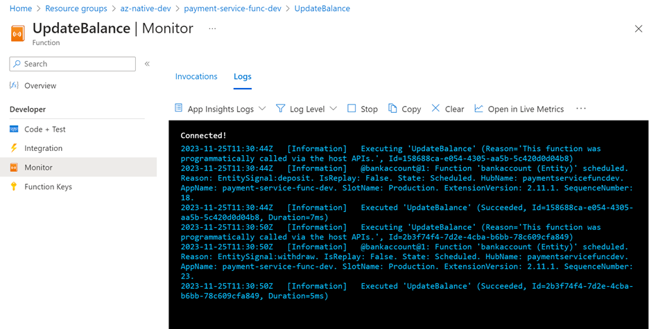
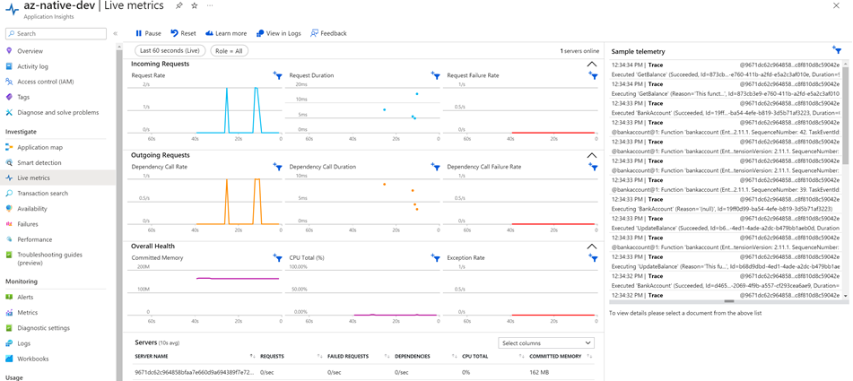

# Solution - Stateful Microservices using Azure Durable Entities

## Task: Create a Durable Entity Bank Account Microservice using Functions

In this lab you will create a stateful microservice using Azure Functions. The microservice will be used to create a customer account using a functional approach. It will offer the following operations:

- GetBalance
- Deposit / Withdraw
- Execute Payment

A test client is provided to test the microservice using REST calls in [test-payment-service.http](./starter/payment-service/test-payment-service.http). In order to use it you need to install the [REST Client](https://marketplace.visualstudio.com/items?itemName=humao.rest-client) extension for Visual Studio Code.

- In the [starter](./payment-service-func) add a new file `bankAccount.cs` and add the following code:

    ```csharp
    using System.Net;
    using System.Net.Http;
    using System.Threading.Tasks;
    using Microsoft.Azure.WebJobs;
    using Microsoft.Azure.WebJobs.Extensions.DurableTask;
    using Microsoft.Azure.WebJobs.Extensions.Http;
    using Microsoft.Extensions.Logging;

    namespace FoodApp
    {
        public static class BankAccount
        {

        }
    }
    ```

- Add the Durable Entity `bankAccount` to the static class:

    ```c#
    [FunctionName(nameof(BankAccount))]
        public static void BankAccountHandleOperation([EntityTrigger] IDurableEntityContext context)
        {
            switch (context.OperationName.ToLowerInvariant())
            {
                case "deposit":
                    context.SetState(context.GetState<int>() + context.GetInput<int>());
                    break;
                case "withdraw":
                    var balance = context.GetState<int>() - context.GetInput<int>();
                    context.SetState(balance);
                    break;
            }
        }
    ```

- Add a function to update the balance just beneath the `bankAccount`. It contains implementations for the `Deposit` and `Withdraw` operations:

    ```c#
    [FunctionName("UpdateBalance")]
    public static async Task<HttpResponseMessage> UpdateBalance(
    [HttpTrigger(AuthorizationLevel.Function, Route = "bankAccount/updateBalance/{entityKey}/{amount}")] HttpRequestMessage req,
    [DurableClient] IDurableEntityClient client,
    string entityKey, string amount)
    {
        var entityId = new EntityId(nameof(bankAccount), entityKey);

        if (req.Method == HttpMethod.Post)
        {
            await client.SignalEntityAsync(entityId, "deposit", amount);
            return req.CreateResponse(HttpStatusCode.Accepted);
        }
        else if (req.Method == HttpMethod.Delete)
        {
            await client.SignalEntityAsync(entityId, "withdraw", amount);
            return req.CreateResponse(HttpStatusCode.Accepted);
        }
        return req.CreateResponse(HttpStatusCode.OK);
    }
    ```

- Add a function to get the balance just beneath the `bankAccount`:

    ```c#
    [FunctionName("GetBalance")]
        public static async Task<int> GetBalance(
            [HttpTrigger(AuthorizationLevel.Anonymous, "get", Route = "bankAccount/getBalance/{entityKey}")] HttpRequestMessage req,
            string entityKey,
            [DurableClient] IDurableEntityClient client,
            ILogger log)
        {
            var entityId = new EntityId(nameof(bankAccount), entityKey);
            EntityStateResponse<int> stateResponse = await client.ReadEntityStateAsync<int>(entityId);
            return stateResponse.EntityState;
        }
    ```    

- Now it is time to enter debug mode and deposit, withdraw and get the balance of the customer account using your REST Client. You can use the following commands:

    ```http
    POST http://localhost:7071/api/bankAccount/updateBalance/123/100
    DELETE http://localhost:7071/api/bankAccount/updateBalance/123/50
    GET http://localhost:7071/api/bankAccount/getBalance/123
    ```

- Finally add an `ExecutePayment` operation:

    ```c#
    [FunctionName("ExecutePayment")]
    public static async Task<int> ExecutePayment(
    [HttpTrigger(AuthorizationLevel.Anonymous, "get", Route = "bankAccount/executePayment/{entityKey}/{amount}")] HttpRequestMessage req,
    string entityKey,
    string amount,
    [DurableClient] IDurableEntityClient client,
    ILogger log)
    {
        int intAmount = int.Parse(amount);
        var entityId = new EntityId(nameof(bankAccount), entityKey);
        EntityStateResponse<int> stateResponse = await client.ReadEntityStateAsync<int>(entityId);

        if(stateResponse.EntityExists)
        {
            if(stateResponse.EntityState >= intAmount)
            {
                await client.SignalEntityAsync(entityId, "withdraw", amount);
            }
            else
            {
                log.LogInformation($"Insufficient funds. Current balance: {stateResponse.EntityState}");
            }
        }
        else
        {
            log.LogInformation($"Entity {entityKey} does not exist.");
        }
        return stateResponse.EntityState;
    }
    ```   

    >Note: This function is not at it's final state. Later on we will use pub/sub to receive the payment request and also publish the payment status as a response message.

- Debug the function and execute the following command:

    ```http
    GET http://localhost:7071/api/bankAccount/executePayment/123/50
    ```

    >Note: The payment will be executed and the balance will be reduced by 50. We want to make sure that the balance is not reduced below 0.

    ```http
    GET http://localhost:7071/api/bankAccount/executePayment/123/50000
    ```

    >Note: The payment will not be executed because the balance is not sufficient. 

## Task: Publish & Test the Durable Entity Bank Account Microservice

- Execute `deploy-app.azcli`

- Update `@paymentsUrl` in `test-payment-service.http`

- Test the online deployment using `test-payment-service.http`

- You should be able to see the log messages of your tests using the Functions Monitor in the Azure Portal.

    

- You should also be able to see the Live Metrics in your Application Insights instance.

        