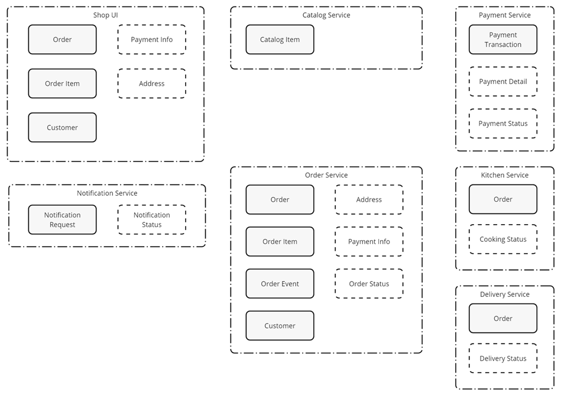
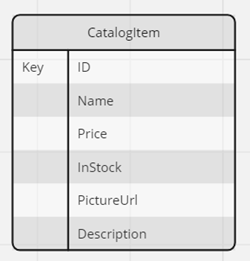
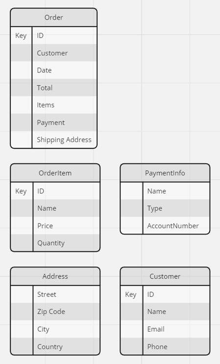
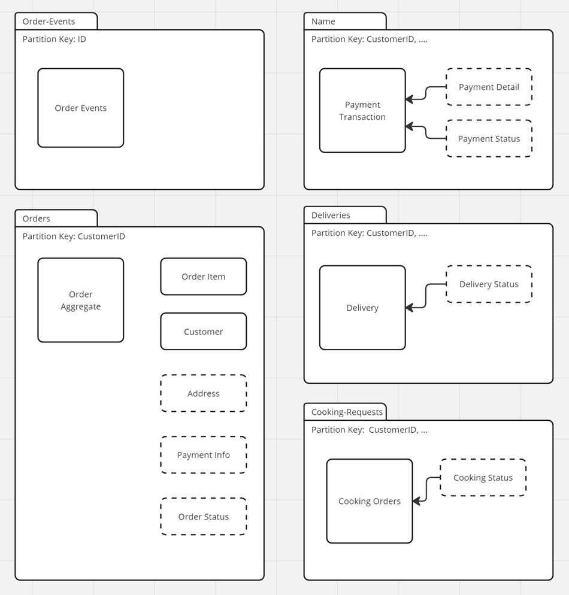

# Lab 05 - Domain Driven Design, NoSQL Data & Event storage using Cosmos DB

In this lab we will design our basic data model and keep aspects of Domain Driven Design in mind. 

We will use Azure SQL for the Catalog service, and Cosmos DB as our NoSQL database and event store for all other services. 

## Task: Domain Driven Design

- With the given Architecture diagram in mind, identify the entities, value objects and aggregates for the following services. We will discuss the results in class afterwards.

  - Catalog Service
  - Orders Service
  - Payment Service
  - Kitchen Service (Production)
  - Delivery Service
  
    

- Possible Solution:

  

## Task: Designing the Data Model

- `Catalog Service` has one main entity:

    

- `Food Shop UI` has the following entities and value objects:   

    

- Possible Solution:

   

## Task: Create & Deploy the Physical Design

- Use the Cosmos DB Account created in Lab 01 to create the containers for `food-app` in a `food-nosql-$env` database. To keep this simple we will use the same database for all services. In a real world scenario you would create a database for each service.

- Create the containers `orders` and `order-events` and chose a partition key. Use `IaC (Azure CLI or Bicep)` in order to be able to drop and recreate the containers easily.

- Possible Solution:

   

## Task: Event Sourcing & CQRS

- Take the [Event Sourcing](../../demos/05-cosmos/05-event-sourcing/) & [CQRS demos](../../demos/05-cosmos/06-cqrs/) from this module as a reference and implement CQRS & Event Sourcing for the `Orders Service` in your own project.

    - Deploy Cosmos DB and the required containers
    - Test the event store
    - Implement the event processor
    - Implement the CQRS pattern using MediatR
    - Test the CQRS pattern
    - Add a `getAllOrdersForCustomer` method with a `customerId` parameter to the `OrdersController` and implement the query side of the CQRS pattern
    
    >Note: You can copy some of the code but use your own project to set up the solution. The goal is to be able to setup CQRS & Event Sourcing on your own.   

## Task: Test the CQRS Orders Service

- Test the following apps are working together correctly on Azure Container Apps:

  - Orders Service CQRS
  - Order Events Processor