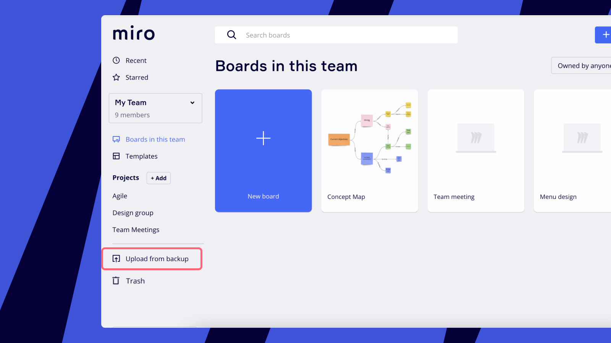

# Lab 05 - NoSQL Data & Event storage using Cosmos DB

In this lab we will design our basic data model and keep aspects of Domain Driven Design in mind. 

We will use Azure SQL for the Catalog service, Redis for Production (Kitchen) and Cosmos DB as our NoSQL database and event store for all other services. 

## Task: Domain Driven Design

- With the given Architecture diagram in mind, identify the entities, value objects and aggregates for the following services. We will discuss the results in class afterwards.

  - Catalog Service
  - Orders Service
  - Payment Service
  - Kitchen Service (Production)
  - Delivery Service
  
    

- Do not go into too much detail. Just identify the main entities and value objects for each service as you will create 

- You will use the output of this task later on to create containers in Cosmos DB.

- You can use a pice of paper or an online whiteboard like [draw.io](https://draw.io/) or [Miro](https://miro.com/) to draw your results.  

## Task: Order Service Bounded Context

- Document the `Order Service Bounded Context`. If you want you can use [Miro and the Bounded Context Canvas](https://miro.com/miroverse/the-bounded-context-canvas/), some other tool or even a piece of paper.

- Follow the guide on [GitHub](https://github.com/ddd-crew/bounded-context-canvas)

## Task: Designing the Data Model

- `Catalog Service` has one main entity - `CatalogItem`:

    ```c#
    public class CatalogItem
    {
        public int ID { get; set; }
        public string Name { get; set; }
        public decimal Price { get; set; }
        public int InStock { get; set; } 
        public string PictureUrl { get; set; }
        public string Description { get; set; }
    }
    ```

- `Food Shop UI` has the following entities and value objects:   

    ```typescript
    export class Order {
        id = '';
        customer: Customer;
        shippingAddress: Address;
        payment: Payment;
        items: CartItem[];
        total = 0;
        status: OrderStatus;
    }

    export class Payment {
        type = '';
        account = '';
    }

    export class Address {
        street = '';
        city = '';
        state = '';
        zip = '';
    }

    export class Customer {
        id = '';
        name = '';
        email = '';
        address: Address = new Address();
    }

    export class CartItem {
        id = 0;
        name = '';
        price = 0;
        quantity = 0;
    }
    ```

- Design the data model for the `Orders Service` based on the entities and value objects you identified in the previous task and the `Food Shop UI` data model.

## Task: Designing the Domain Message Flow Model

- Document the `Order Service Domain Message Flow Model`. If you want you can restore the backup of [Miro and the Domain Message Flow Model - Domain-Message-Flow-Modelling-en-v1.rtb](https://github.com/ddd-crew/domain-message-flow-modelling/blob/master/resources/), or some other tool or even a piece of paper. The goal here is not so much to create a perfect model but to get a feeling for the different messages that are exchanged between the services.

    >Note: To restore the backup in Miro, click on the `Import` button in the top right corner and select the file.

    

- If you don't want to draw charts just implement the classes and the interfaces for the message flow in `C#` or `TypeScript` and document the message flow in the code. You can do this in a separate project or in plain markdown or a diagram tool of your choice.

## Task: Create the Cosmos DB Containers    

- Use the Cosmos DB Account created in Lab 01 to create the containers for `food-app` in a `food-app` database. To keep this simple we will use the same database for all services. In a real world scenario you would create a database for each service.

- Create the following containers and chose a partition key 

  - `CatalogItems` for the `Catalog Service`
  - `Orders` for the `Orders Service`
  - `Payments` for the `Payment Service`
  - `Production` for the `Kitchen Service`
  - `Deliveries` for the `Delivery Service`

## Task: CQRS & Event Sourcing - Optional

- Take the demos from this module as a reference and implement CQRS & Event Sourcing for the `Orders Service` in your own project.