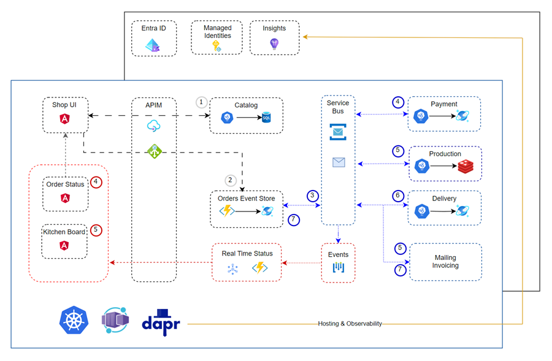
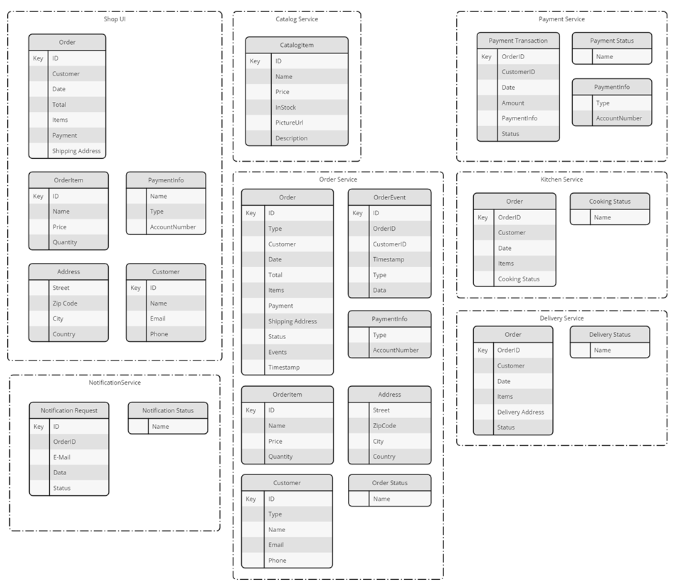

# Solution - Domain Driven Design, NoSQL Data & Event storage using Cosmos DB

## Architecture

## Task: Domain Driven Design

## Task: Designing the Data Model

## Task: Create the Physical Design

## Task: Implement Event Sourcing

- Open [order-event-processor](./order-events-processor/) in a new VS Code instance.

- Make sure you copied the correct settings to `CosmosDBConnectionString`

- Examine `ProcessOrders.cs` and notice how it consumes the change feed from Cosmos DB. Notice how it creates the initial order in the `orders` container and then updates the order with the events from the `order-events` container.

## Task Implement CQRS

>Note: Some functionality is outsourced to the [food-app-common](./food-app-common/) class library to avoid code duplication. 

- Open [order-service-cqrs](./order-service/) in a new VS Code instance.

- Make sure you copied the correct settings to `appsettings.json`

- Examine `orders-api.csproj` and the referenced packages including MediatR.

- Examine Program.cs and the `IOrderAggregates`, `IOrderEventsStore` and `AddMediatR`. Also look at the implementation code of the interfaces.

- Examine OrdersController.cs and the injection of `ISender`.

- Examine the CQRS folder and the content of Queries and its Handlers. Try to understand its purpose.

- Examine the CQRS folder and the content of Commands and its Handlers. Try to understand its purpose.

- Start the app in F5 debug mode and use the provides `orders-tester.http` to submit an order.

- Check if the order event was stored in the `order-events` container.

## Task: Deploy the order-service and order-events-processor Function App

- Go to the solution folder and run `create-images.azcli`

- `deploy-app.azcli` will deploy the app to a classis function app host

- `deploy-app-aca.azcli` will deploy the app to an Azure Container Apps

- Deploy one app after the other and think how you could test the app after each deployment.

  Examples:

  - After deploying the catalog service, you can test the API using the Swagger UI.

  - After deploying the order service use the REST Client to submit an order and check if it was stored in the database.

  - After deploying the shop-ui you can submit an order using the UI. Again you can check if the order was stored in the database. Don't worry about the duplicate orders for now.

  - After deploying the shop-ui you can submit an order using the UI. Again you can check if the order was stored in the database. Don't worry about the duplicate orders for now.

  - Run the event processor on the local machine and submit another order. Check if the order was stored in the `orders` container.