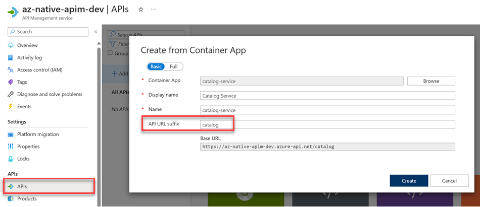
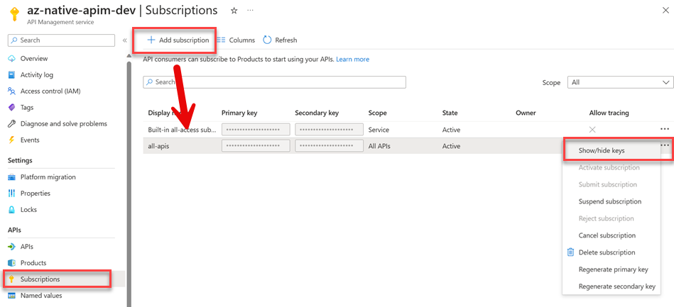

# Lab 08 - Optimizing and Securing Access using Api Management & Application Gateway

In this lab we will publish Catalog and Order services using Azure API Management and secure access to the services using Azure Application Gateway.

## Task: Publish Catalog and Order services using Azure API Management

- Create a new API Management instance using the `Consumption pricing tier` in the same resource group as the other services.

- Create a new API in API Management for the Catalog service hosted by Azure Container Apps. Use the suffix `catalog` for the API URL.

    

- Repeat this steps for the Order Service CQRS using the suffix `orders`.

    >Note: If you have re-deployed your services, do not forget to set `* CORS policies` in Azure Container Apps for the Catalog and Order services.

- Create a Subscription Key for all APIS in the API Management instance and add it to the KeyVault as a secret with the name `subscription-key` so you cannot forget it.

    

- The Subscription key will be attached to the header of the http requests to the services using a functional Angular interceptor that takes the value from the Angular environment. You will override the value by injecting an environment variable `ENV_APIM_KEY` in the Azure Container Apps instance.

    ```typescript
    export const apimInterceptor = () => {
        const interceptor: HttpInterceptorFn = (req: HttpRequest<unknown>, next: HttpHandlerFn) => {
            var request = req.clone({
                headers: req.headers.set(
                    'Ocp-Apim-Subscription-Key',
                    environment.azure.apimSubscriptionKey
                )
            });
            return next(request);
        };
        return interceptor;
    };
    ```

- Deploy or re-deploy the Food Shop UI to Azure Container instances and set the environment variable `ENV_APIM_KEY` to the value of the `subscription-key` secret in the KeyVault. Also update the values for `ENV_CATALOG_API_URL` and `ENV_ORDERS_API_URL` to reflect the `Gateway URL` You should be familiar with this process by now. Use the following values for the URLs:

    ```
    Service URL: `https://<your-apim-name>.azure-api.net/<service-suffix>`
    ```

    >Note: As alternative to hosting a Single Page Application in a container, you could as well use [Azure Static Web Apps](https://learn.microsoft.com/en-us/azure/static-web-apps/). A possible Azure DevOps pipeline is available [here](/app/deploy/pipelines/angular-ci-cd-swa.yml). It uses a [tokenizer](https://josh-ops.com/posts/angular-tokenization/) as injecting envrionment variables is not an option, and would need adjustments to reflect our configuration. In this class we use container based deployment to have a consistent deployment process for all services and frontends.

## Task: Secure access to the services using Azure Application Gateway


## Task: Implement a Backend for Frontend (BFF) service using GraphQL

