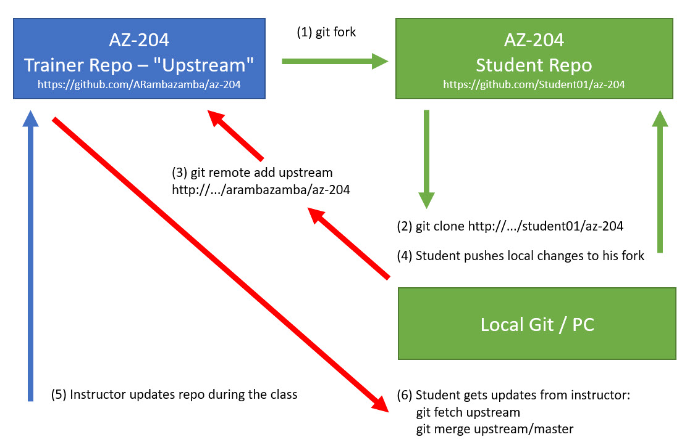

# Getting Started with Source Control

## Introduction

- [Configuration](#configuration)
- [Basic Git Commands](#basic-git-commands)
- [Branching](#branching)
- [Checkout Commits](#checkout-commits)
- [Tags](#tags)
- [Configure ignored files](#configure-ignored-files)
- [Remotes](#remotes)
- [Forking Workflow - Getting Updates for Class Demos](#forking-workflow---getting-updates-for-class-demos)
- [Listing the current Remotes](#listing-the-current-remotes)
- [Adding the Fork Source as Upstream](#adding-the-fork-source-as-upstream)
- [Getting Updates](#getting-updates)
- [Working with Submodules](#working-with-submodules)
- [Git-flow](#git-flow)
- [Conventional Commits](#conventional-commits)

## Links & Resources

[Git Bash Download](https://git-scm.com/downloads)

[Git Extensions for Windows](https://sourceforge.net/projects/gitextensions/)

[Git Graph VS Code](https://marketplace.visualstudio.com/items?itemName=mhutchie.git-graph)

[Git History Diff](https://marketplace.visualstudio.com/items?itemName=huizhou.githd)

## Additional Labs & Walkthroughs

[Introduction to Git](https://docs.microsoft.com/en-us/learn/modules/intro-to-git/)

[Learning Path - Introduction to version control with Git](https://docs.microsoft.com/en-us/learn/paths/intro-to-vc-git/)

## Git / Github Essentials

### Configuration

Set User and E-Mail

```
git config --global user.name "Your Name"
git config --global user.email "your.email@yourdomain.com
```

Unset Credentials

```
git config --global --unset credential.helper
```

### Basic Git Commands

Init Git:

```
git init
```

Get Status

```
git status
```

Stage all files:

```
git add .
```

Stage a specific file and all TypeScript files:

```
git add file.txt | *.ts
```

Commit files:

```
git commit -m "your check-in comment"
```

### Branching

List Branches:

```
git branch
```

List remote branches:

```
git branch -r
```

Create Branch:

```
git branch feature/feature_name
```

Push new Branch to remote:

```
git push origin [name_of_your_new_branch]
```

Switch to Branch:

```
git checkout [name_of_your_branch]
```

> Note: When switching branches it is always good advice to check the status with `git status` on a windows machine. When there are changes from other branches on the disk you can clean the branch using `git clean -f`

Merge Branch:

```
git merge [branch_to_merge]
```

> Note: You might have to switch to the branch that you might want to merge into befor executing merge

### Checkout Commits

Get a specific Commit:

```
git checkout <sha1>
```

sha1:


> Note: This will result in a detached Head.

If you want to delete your changes associated with the detached HEAD:

```
git checkout master
```

If you want to keep the detached state save it into a new branch and continue from there:

```
git branch save-detached-head
```

> Note: You will have to switch to the branch you saved to afterwards

## Tags

Create Lightweight tag :

```
git tag -l v1.1.0
```

Create Annotated tag :

```
git tag -a v2.0.1 -m "fixed Bug on replaced data layer. do not use v.2.0.0"
```

List all tags:

```
git tag
```

Show a specific tag:

```
git show v2.0.1
```

Push tags to Remote:

```
git push origin v2.0.1 | git push --tags
```

Delete tag:

```
git tag -d v2.0.1
```

Checkout tag:

```
git checkout 2.0.1
```

## Configure ignored files

To Configure ignored files add a `.gitignore` file to the root of your project. A valid `.gitignore` file can be generated at https://www.gitignore.io/

## Remotes

A Remote is a GIT Repo on a Git Server, typically in the cloud, like GitHub.

Adding Remotes:

```
git remote add origin https://github.com/try-git/try_git.git
```

Pull / Push from / to repository:

```
git pull / git push
```

## Forking Workflow - Getting Updates for Class Demos



Original Repo could be: `https://github.com/ARambazamba/AZ-204` where `ARambazamba` is the `original-owner-github-username` and `AZ-204` is the `reponame`

### Listing the current Remotes

List the current configured remote repository for your fork.

```
git remote -v
> origin  https://github.com/your-github-username/reponame.git (fetch)
> origin  https://github.com/your-github-username/reponame.git (push)
```

Specify a new remote upstream repository that will be synced with the fork.

### Adding the Fork Source as Upstream

```
git remote add upstream https://github.com/original-owner-github-username/reponame.git
```

Verify the new upstream repository you've specified for your fork.

```
git remote -v
> origin    https://github.com/your-github-username/reponame.git (fetch)
> origin    https://github.com/your-github-username/reponame.git (push)
> upstream  https://github.com/original-owner-github-username/reponame.git (fetch)
> upstream  https://github.com/original-owner-github-username/reponame.git (push)
```

### Getting Updates

Fetch from Upstream:

```
 git fetch upstream
 git merge upstream/main
 git push origin main
```

### Working with Submodules

Add a Submodule:

```
git submodule add https://github.com/ARambazamba/FoodApp FoodApp
git commit -m food-app-submodule
```

Updating a Submodule to it's latest commit:

```
git submodule update --remote --merge
```

> Note: I use submodules to include samples in classes that are used in different classes or to shorten / avoid path problems in devops

### Git-flow

GitFlow is a branching model for Git, created by Vincent Driessen. It has attracted a lot of attention because it is very well suited to collaboration and scaling the development team.

[Git-flow Introduction & Cheat sheet](https://danielkummer.github.io/git-flow-cheatsheet/)


> Note: Require GIT 2.24.0+ - Check with `git --version`

Initialize repo for git-flow:

```
git flow init
```

Start a new feature:

```
git flow feature start feature_name
```

Finish feature:

```
git flow feature finish feature_name
```

Publish a feature:

```
git flow feature publish  feature_name
```

Start a release:

```
git flow release start RELEASE
```

Finish a release:

```
git flow release finish  RELEASE
```

### Conventional Commits

This repo is using [Conventional Commits](https://www.conventionalcommits.org/en/v1.0.0/). The root of this directory contains a package.json file with a script to generate a changelog based on the commit messages. To use this feature you have to install the dependencies:

```bash
npm install
```

To generate a changelog run:

```bash
changelog
```

| Type     | Title            | Description                                      |
|----------|------------------|--------------------------------------------------|
| feat     | Features         | A new feature                                    |
| fix      | Bug Fixes        | A bug fix                                        |
| docs     | Documentation    | Documentation only changes                       |
| style    | Styles           | Changes that do not affect the meaning of the code (white-space, formatting, missing semi-colons, etc) |
| refactor | Code Refactoring | A code change that neither fixes a bug nor adds a feature |
| perf     | Performance Improvements | A code change that improves performance |
| test     | Tests            | Adding missing tests or correcting existing tests |
| build    | Builds           | Changes that affect the build system or external dependencies (example scopes: gulp, broccoli, npm) |
| ci       | Continuous Integrations | Changes to our CI configuration files and scripts (example scopes: Travis, Circle, BrowserStack, SauceLabs) |
| chore    | Chores           | Other changes that don't modify src or test files |
| revert   | Reverts          | Reverts a previous commit                         |
